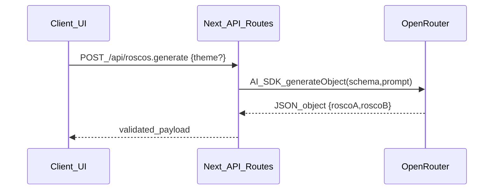

# Pasapalabra: Next.js + AI SDK (OpenRouter)

## Goals

- Turn the single-file React prototype into a runnable **Next.js (App Router) + TypeScript** application.
- Move the **rosco generation** AI call to a **server-side endpoint** using **Vercel AI SDK** with **OpenRouter**, keeping keys off the client.
- Refactor into small, readable components and a central game-state hook while preserving current behavior/UI.

## Key decisions already made

- **Framework**: Next.js (React)
- **AI provider**: OpenRouter (OpenAI-compatible)

## Repo initialization (terminal)

- Initialize a Next app in this repo root using a TS template and add Tailwind for styling.
- Add AI SDK packages and `zod` for strict request/response validation.

## Architecture

## Proposed file structure

- App shell
- [` ``/Users/lau/Github/pasapalabra/src/app/layout.tsx`` `](/Users/lau/Github/pasapalabra/src/app/layout.tsx)
- [` ``/Users/lau/Github/pasapalabra/src/app/page.tsx`` `](/Users/lau/Github/pasapalabra/src/app/page.tsx)
- UI components (split from the monolith)
- [` ``/Users/lau/Github/pasapalabra/src/components/HeaderBar.tsx`` `](/Users/lau/Github/pasapalabra/src/components/HeaderBar.tsx)
- [` ``/Users/lau/Github/pasapalabra/src/components/RoscoCircle.tsx`` `](/Users/lau/Github/pasapalabra/src/components/RoscoCircle.tsx)
- [` ``/Users/lau/Github/pasapalabra/src/components/ControlPanel.tsx`` `](/Users/lau/Github/pasapalabra/src/components/ControlPanel.tsx)
- [` ``/Users/lau/Github/pasapalabra/src/components/GeneratorModal.tsx`` `](/Users/lau/Github/pasapalabra/src/components/GeneratorModal.tsx)
- Game logic + types
- [` ``/Users/lau/Github/pasapalabra/src/game/types.ts`` `](/Users/lau/Github/pasapalabra/src/game/types.ts) (interfaces/enums)
- [` ``/Users/lau/Github/pasapalabra/src/game/defaultQuestions.ts`` `](/Users/lau/Github/pasapalabra/src/game/defaultQuestions.ts)
- [` ``/Users/lau/Github/pasapalabra/src/game/validation.ts`` `](/Users/lau/Github/pasapalabra/src/game/validation.ts) (normalize/validateItem)
- [` ``/Users/lau/Github/pasapalabra/src/game/sound.ts`` `](/Users/lau/Github/pasapalabra/src/game/sound.ts) (WebAudio helpers)
- [` ``/Users/lau/Github/pasapalabra/src/game/usePasapalabraGame.ts`` `](/Users/lau/Github/pasapalabra/src/game/usePasapalabraGame.ts) (state machine + timer + undo + shortcuts)
- AI server route (AI SDK + OpenRouter)
- [` ``/Users/lau/Github/pasapalabra/src/app/api/roscos.generate/route.ts`` `](/Users/lau/Github/pasapalabra/src/app/api/roscos.generate/route.ts)
- [` ``/Users/lau/Github/pasapalabra/src/server/ai/openrouter.ts`` `](/Users/lau/Github/pasapalabra/src/server/ai/openrouter.ts) (createOpenAI w/ baseURL)
- [` ``/Users/lau/Github/pasapalabra/src/server/ai/schemas.ts`` `](/Users/lau/Github/pasapalabra/src/server/ai/schemas.ts) (zod schema for roscos)

## AI integration details (roscos only)

- Use **Vercel AI SDK** on the server:
- `generateObject` with a zod schema `{ roscoA: [...], roscoB: [...] }` enforcing exactly 27 entries with the Spanish alphabet (including Ñ).
- OpenRouter configuration (server only):
- Env: `OPENROUTER_API_KEY`
- Base URL: `https://openrouter.ai/api/v1`
- Model default (configurable): e.g. `openai/gpt-4o-mini`.

## UX/behavior preservation

- Keep:
- Two roscos, per-player timers, pause, undo (1 step), keyboard shortcuts.
- “Modo público” collapse behavior.
- Sound toggle + synthesized sounds.
- Remove:
- The “Dato Curioso” button and its UI area.

## Environment + docs

- Add `.env.example` with `OPENROUTER_API_KEY` and optional `OPENROUTER_MODEL`.
- Add `README.md` with setup + run instructions.

## Acceptance checks

- `npm run dev` starts successfully and UI renders.